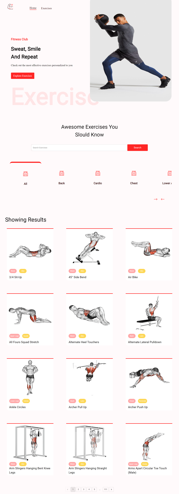

<h1 style="color:#facd8a ">Gym-Exercises-App </h1>

<h1 style="color:#facd8a "> Front-end Technologies and liberaries </h1>

    - HTML
    - CSS
    - JavaScript
    - react
    - material UI
    - Rabid API 

  <h1 style="color:#facd8a "> features</h1>
  
    - explore GYM exercises
    - choose exercise by body part (muscle)
    - search for exercises by :
        1- body part ( muscle)
        2- machine name 
        3- exercise name
    - exercise page has information about the exercise selected
    - support YouTube videos to learn how to do this exercise

  <h3 style="color:#facd8a ">Full Website Screenshot</h3>
    
    <h3 style="color:#facd8a ">exercise page Screenshot</h3>
    
    

<h1 style="color:#facd8a "> Check out Website Here </h1>

> [Youtube video](https://youtu.be/IWMi91jJkA8)

